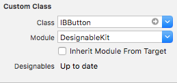
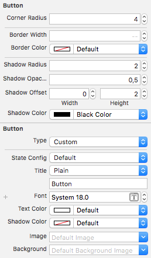

# DesignableKit

[](https://github.com/Carthage/Carthage)
[](https://travis-ci.org/varvet/DesignableKit)
[](https://codeclimate.com/github/varvet/DesignableKit/test_coverage)
[](https://codeclimate.com/github/varvet/DesignableKit/maintainability)

A collection of class that you can use to give you more options in how to style your buttons and views in interface builder. 

Helps you keep your view and buttons customisation in the interface builder.

## Installation

### Carthage

Make the following entry in your Cartfile:

```
github "varvet/DesignableKit"
```

Then run `carthage update`.

## Usage

To use DesignableKit all you need to do after you have imported the framework is to set the class to `IBButton` for a `UIButton` and `IBView` for a `UIView`. Then you need to set the module to DesignableKit.



Once the above is done you should see a lot more attributtes to under the attributtes inspector that you you can manipulate. The changes should be shown immediately in interface builder if everything was done right. 


